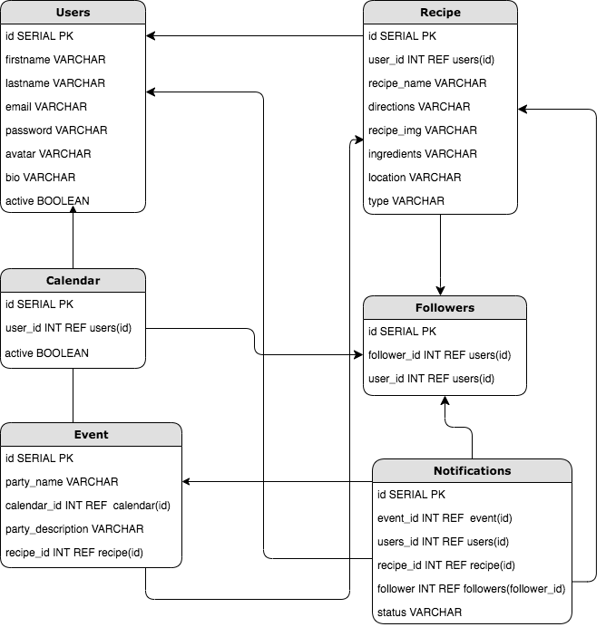

# Pantry-Party
Pantry

## Database Schema
### Tables and Columns 
* __Users__
  * `id` : Integer Primary Key
  * `firstname`: String
  * `lastname`: String
  * `email`: String
  * `password`: String
  * `avatar`: String
  * `bio`: String
  * `active`: Boolean
  
* __Recipes__
  * `id` : Integer Primary Key
  * `user_id`: Integer REFERENCES users(id)
  * `recipe_name`: String
  * `directions`: String
  * `recipe_img`: String
  * `ingredients`: String
  * `location`: String
  * `type`: String
  
* __Followers__
  * `id`: Integer Primary Key
  * `user_id`: Integer REFERENCES users(id)
  * `follower_id`: Integer REFERENCES users(id)
  
* __Calendar__
  * `id`: Integer Primary Key
  * `user_id`: Integer REFERENCES users(id)
  * `active`: BOOLEAN
  
* __Events__
  * `id`: Integer Primary Key
  * `party_name`: String
  * `calendar_id`: Integer REFERENCES calendar(id)
  * `party_description`: String
  * `recipe_id`: Integer REFERENCES recipe(id)
  
* __Notifications__
  * `id`: Integer Primary Key
  * `event_id`: Integer REFERENCES event(id)
  * `users_id`: Integer REFERENCES users(id)
  * `recipe_id`: Integer REFERENCES recipe(id)
  * `follower`: Integer REFERENCES followers(follower_id)
  * `status`: String

### Diagram 

## Backend Routes/API
* __Users__
  * GET `/users`: Gets all of the users.
  * GET `/users/:id`: Get a single user by id.
  * POST `/users/new`: Creates new user.
  * PATCH `/users/update/:id`: Update single user.
  * DELETE `/users/remove/:id`: Delete single user.

* __Recipes__
  * GET `/recipe/:recipe_id`: Gets single recipe in users database. 
  * GET `/recipe/search/:recipe_type`: Get single recipe by type of dish.
  * GET `/recipe/search/:ingredient`: Get single recipe by ingredient.
  * GET `/recipe/search/:location`: Get single recipe by location of origin.
  * POST `/recipe/new`: Create new recipe.
  * PATCH `/recipe/update/:recipe_id`: Update single recipe.
 
* __Followers__
  * GET `/followers/all/:user_id`: Gets all followers for user.
  * GET `/followers/following/all/:user_id`: Gets all accounts user is following.
  * POST `/followers/:user_id/:follower_id`: Create new follower.
  * DELETE `/followers/:user_id/:follower_id`: Delete single follow.
  
* __Calendar__
  * GET `/calendar/:user_id`: Get calendar for user.
  * PATCH `/calendar/update/:user_id`: Update single calendar.
  
* __Events__
  * GET `/event/all/:calendar_id`: Gets all event for user.
  * GET `/event/:event_id`: Get single event.
  * POST `/event/new/:calendar_id`: Create new event.
  * PATCH `/event/update/:event_id`: Update single event.
  * DELETE `/event/remove/:event_id`: Delete single event.
  
* __Notifications__
  *

## Frontend
### Wireframes
